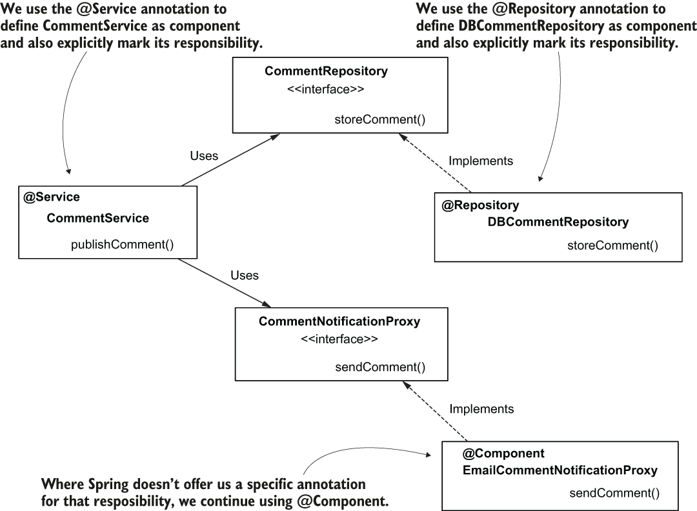

## 4. The Spring Context: Using Abstractions
### Interface とは:
Interface は、クラスがどのようなメソッドを持っているのかをあらかじめ定義する、設計書のような存在。クラスとは異なり、具体的な処理内容を記述せず、メソッドの引数や戻り値だけを定義する。Contract（契約）を結ぶとも言う。

例として、配達されるパッケージの詳細を印刷する DeliveryDetailsPrinter オブジェクトを実装とする。詳細を印刷するメソッドは配送先住所で Sort される必要があり、その並べ替えの責任を SortByAddress のオブジェクトに委任するとする。この場合、DeliveryDetailsPrinter と SortByAddress は強く結合しているため、もし並べ替え方を変更する必要があった場合、様々な箇所の変更を加える必要がる。

```java
public class DeliveryDetailsPrinter {
  private SorterByAddress sorter; // <- ここ

  public DeliveryDetailsPrinter(SorterByAddress sorter) { // <- ここ
    this.sorter = sorter;
  }

  public void printDetails() {
    sorter.sortDetails(); // <- ここ
    // printing the delivery details
  }
}
```

インターフェースを使って decouple（抽象化）する。特定の実装に直接依存する代わりに、DeliveryDetailsPrinter はインターフェース（契約）に依存する。これにより、DeliveryDetailsPrinter は特定の実装に縛られることなく、このインターフェースを実装する任意のオブジェクトを使用できるようになる。

<p align="center">

</p>

```java
public interface Sorter {
  void sortDetails();
}

public class DeliveryDetailsPrinter {
  private Sorter sorter;

  public DeliveryDetailsPrinter(Sorter sorter) {
    this.sorter = sorter;
  }

  public void printDetails() {
    sorter.sortDetails();
    // printing the delivery details
  }
}
```

### フレームワークを使用せずに要件を実装してみる:
チームがタスクを管理するために使用するアプリを実装しているとする。このアプリで実装する機能として：
1. ユーザーがタスクにコメントを残すことができる。
   - ユースケースを実装するオブジェクトをサービスと呼ぶことが一般的
   - 「コメントを公開する」ユースケースを実装するサービスが必要であるため、```CommentService``` を作成する。
2. ユーザーがコメントを公開すると、それがデータベースに保存される。
   - データベースと直接やり取りをするオブジェクトを持つ場合、通常リポジトリと呼ぶ（時にはデータアクセスオブジェクト（DAO）と呼ばれることもある）。コメントを保存する責任を持つオブジェクト ```CommentRepository``` を作成する。
3. 特定のアドレスにメールが送信する。
   - アプリの外部と通信する責任を持つオブジェクトを実装する場合、それらのオブジェクトをプロキシと呼ぶ。メールを送信する責任を持つオブジェクト ```CommentNotificationProxy``` を作成する。

<p align="center">

</p>

実装は [ex3](/exercises/ex3/) を参照。

### Spring を使用して実装してみる:
アプリの全オブジェクトを context に追加する必要はなく、この場合、コンテキストから依存性を注入する必要があるオブジェクト、またはそれ自体が依存性であるオブジェクトを context に追加する必要がある。依存性を持たない唯一のオブジェクトは ```Comment```（コメントのデータを保存するPOJO）であり、他のオブジェクトは依存関係を持つ。

<p align="center">

</p>

灰色のオブジェクトは ```@Component``` アノテーションで Bean として context に追加するもの。

```java
@Component
public class DBCommentRepository implements CommentRepository {
    @Override
    public void storeComment(Comment comment) {
        System.out.println("Storing comment: " + comment.getText());
    }
}
```

```@ComponentScan``` アノテーションで Bean として登録したいクラスを見つける方法を指定する。

```java
@Configuration
@ComponentScan(basePackages = {"proxies", "services", "repositories"})
public class ProjectConfiguration {
}
```

Main メソッドで context を呼び出してみる。

```java
public class Main {
    public static void main(String[] args) {
        var context = new AnnotationConfigApplicationContext(ProjectConfiguration.class);

        var comment = new Comment();
        comment.setAuthor("Hiroto");
        comment.setText("Demo comment!");

        var commentService = context.getBean(CommentService.class);
        commentService.publishComment(comment);
    }
}
```

Spring を使った DI（依存性注入）をすることで、CommentService オブジェクトおよびその依存関係のインスタンスを自分で作成する必要がなく、明示的にそれらの関係を作る必要も無くなった。

### 複数の抽象クラスの実装をオートワイヤする場合
要件別に複数のクラスが CommentNotificationProxy の実装をしている場合、CommentService がどの実装を使うか指定する必要がある。
- ```@Primary``` 
- ```@Qualifier```

これらのアノテーションを Bean に付与することで指定可能になる。
ここでは ```@Qualifer``` アノテーションを使ってみる。

<p align="center">

</p>

以下のように ```@Qualifier``` で Bean 名を付ける。

```java
@Component
@Qualifier("PUSH")
public class CommentPushNotificationProxy 
  implements CommentNotificationProxy {
  // Omitted code
}

@Component
@Qualifier("EMAIL")
public class EmailCommentNotificationProxy 
  implements CommentNotificationProxy {
  // Omitted code
}
```

そして、CommentService で CommentPushNotificationProxy を使う場合、以下のように依存関係を指定できる。

```java
@Component
public class CommentService {
  private final CommentRepository commentRepository;
  private final CommentNotificationProxy commentNotificationProxy;
 
  public CommentService(
      CommentRepository commentRepository,
      @Qualifier("PUSH") CommentNotificationProxy commentNotificationProxy) {
    this.commentRepository = commentRepository;
    this.commentNotificationProxy = commentNotificationProxy;
  }
  // Omitted code
}
```

### ```@Component```、```@Service```、```@Repository```、```@Controller``` ステレオタイプの違い

Spring のステレオタイプについて、動きとしては基本的に同じであり、これらのアノテーションが付与されたクラスは Spring の DI コンテナに bean として登録される。使い分けとしては、Spring MVC においてコントローラー層のクラスには ```@Controller```、サービス層のクラスには```@Service```、データ層のクラスには ```@Repository```、どれにも当てはまらない場合は ```@Component``` を付ける。

全体像として Controller → Service → Repository → Model
- Controller
  - 画面遷移の制御
  - ドメイン層の Service の呼出 (主処理を実行する)
- Service
  - Controller から「ビジネスロジック」を引き受けること
  - Controller の軽量化
- Repository
  - データアクセスの隔離
  - Repository 層は Model の唯一の窓口となる層で、ここにデータアクセスの処理を集約させる

<p align="center">

</p>
